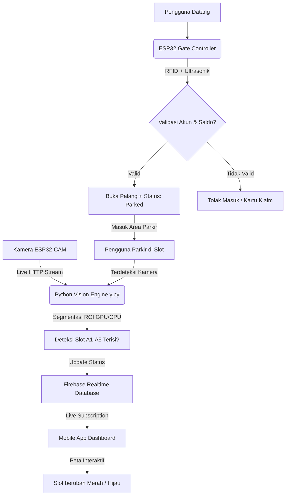

# 🚗 Konsep Sistem Hybrid: AutoPics (Automated Parking System)

Sistem **Hybrid Parking** pada proyek **AutoPics** adalah arsitektur inovatif yang menggabungkan kontrol mekanik fisik perangkat keras (*IoT*), kecerdasan buatan berbasis pengolahan citra (*Computer Vision*), serta sinkronisasi awan (*Cloud Database*) secara *real-time*.

Konsep ini menghilangkan inefisiensi pada sistem parkir konvensional dengan membagi peran secara cerdas antara **RFID** dan **Kamera Visual**.

---

## 1. Pembagian Peran Komponen Sistem

Sistem ini memisahkan logika **Keamanan/Akses** dengan **Deteksi Okupansi Slot** untuk memaksimalkan performa dan efisiensi biaya.

### 🔑 A. RFID (ESP32 Gate Controller) — *Security, Authentication & Billing*
Bertugas di pintu gerbang utama untuk menangani akses masuk dan keluar kendaraan.
*   **Peran**: Mengidentifikasi identitas pengguna melalui kartu RFID fisik, melakukan validasi saldo minimum, dan merekam *timestamp* masuk/keluar untuk kalkulasi biaya secara otomatis.
*   **Karakteristik**: Hanya mencatat status pengguna secara makro (`active`, `parked`, `left`). ESP32 **tidak mengetahui** di slot mana kendaraan tersebut diparkir secara fisik.

### 📷 B. Vision Engine (Python + OpenCV - `y.py`) — *Visual Occupancy Detector*
Bertugas mengawasi seluruh area parkir dari atas menggunakan kamera visual tunggal (**ESP32-CAM**).
*   **Peran**: Menentukan status keterisian slot secara spesifik (**A1, A2, A3, A4, A5**) secara otomatis tanpa sensor fisik di setiap slot.
*   **Karakteristik**: Menggunakan teknik **Region of Interest (ROI)** berbasis akselerasi GPU (PyTorch/OpenCV). Ketika kendaraan mainan menempati suatu slot, AI mendeteksi perubahan visual dan langsung memperbarui database Firebase (`terisi: true`).

---

## 2. Alur Integrasi Real-Time (Hybrid Workflow)

Ketika seluruh sistem disinkronisasikan melalui **Firebase Realtime Database (RTDB)**, alurnya berjalan sebagai berikut:

1.  **Tahap Masuk**: Kendaraan mendekati gerbang $\rightarrow$ Sensor ultrasonik mendeteksi keberadaan objek (< 3 cm) $\rightarrow$ Pengguna menempelkan kartu RFID $\rightarrow$ ESP32 memverifikasi akun dan memastikan sisa slot kosong di Firebase (`kosong` > 0) $\rightarrow$ Gerbang terbuka, status berubah menjadi **`"parked"`**, dan mencatat **`parked_at`**.
2.  **Tahap Parkir**: Pengguna menaruh kendaraannya di slot **A4** $\rightarrow$ Kamera menangkap perubahan visual $\rightarrow$ Python **`y.py`** mendeteksi okupansi $\rightarrow$ Firebase mengupdate `/parkir/slots/motor/A4/terisi = true` $\rightarrow$ Denah interaktif di aplikasi *mobile* mewarnai **Slot A4 menjadi MERAH** secara instan.
3.  **Tahap Keluar**: Kendaraan mendekati pintu keluar $\rightarrow$ Pengguna menempelkan kartu RFID $\rightarrow$ ESP32 menghitung durasi parkir dari *timestamp* `/users/{UID}/parked_at` $\rightarrow$ Saldo dipotong otomatis dan status kembali menjadi **`"left"`** $\rightarrow$ Pintu keluar terbuka.

---

## 3. Keunggulan Utama Konsep Sistem Hybrid

> [!TIP]
> **Efisiensi Biaya Skala Besar (Sangat Ekonomis)**
> Pada sistem konvensional, jika ada 100 slot parkir, Anda memerlukan **100 sensor fisik ultrasonik/magnetik**, 100 modul mikrokontroler kecil, dan ribuan meter kabel. 
> Dengan **Sistem Hybrid AutoPics**, Anda hanya memerlukan **1 buah Kamera (ESP32-CAM)** dan server Vision Engine untuk mengawasi 100 slot tersebut sekaligus secara visual!

*   **Keamanan Anti-Passback Terintegrasi**: Sistem mencatat status pengguna secara *real-time*. Pengguna yang kartunya berstatus `"parked"` tidak akan bisa masuk gerbang lagi sebelum melakukan *tap* keluar terlebih dahulu.
*   **Dashboard HP Interaktif Tanpa NFC**: Alur *Last Tap Claim* memungkinkan pengguna mendaftarkan kartu RFID baru dengan mudah tanpa memerlukan sensor NFC pada ponsel pintar mereka.
*   **Bandwidth & Suhu Teroptimasi**: Batasan **5 FPS** pada *streaming* HTTP menjaga ESP32-CAM tetap dingin dan hemat lalu lintas data jaringan lokal.

---
*Dokumen ini disusun sebagai panduan konseptual arsitektur sistem AutoPics.*
